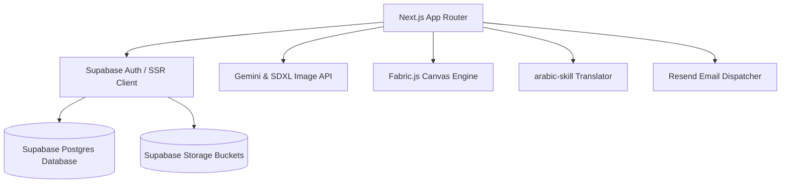

# MediaBubble Brand Studio

<p align="center">
  
</p>

<p align="center">
  <a href="https://nextjs.org/">
    
  </a>
  <a href="https://supabase.com/">
    
  </a>
  <a href="https://tailwindcss.com/">
    
  </a>
  <a href="https://ai.google.dev/">
    
  </a>
  <a href="https://resend.com/">
    
  </a>
</p>

---

## 🌟 Overview

**MediaBubble Brand Studio** is a private, AI-native campaign planning, asset generation, and reporting platform designed for MediaBubble Agency. It transforms unstructured client brand guidelines into structured profiles, generates brand-consistent visual and copy assets across languages and dialects, organizes campaigns via interactive grid and calendar planners, and publishes reports directly to clients through gated approval workflows.

Instead of navigating between Photoshop, Excel, WhatsApp approvals, and scattered reports, Brand Studio unites copywriters, designers, account managers, and clients under a single high-performance pipeline.

---

## 🎯 Key Features

### 1. AI Brand Ingestion
*   **Structured Profiles**: Upload any brand guidelines PDF; Gemini parses typography, colors, tones, and visual strategy.
*   **Asset Hub**: Automatically parses logo variations (primary, dark, white) and watermarks to store them securely.

### 2. Multi-Dialect Copy Engine (`arabic-skill`)
*   **Cultural Context**: Writes authentic copy using the `@mediabubble-adv/arabic-skill` pipeline.
*   **Language Parallelism**: Previews Arabic (RTL) and English (LTR) options side-by-side in content review grids.

### 3. Visual Canvas Composer (Fabric.js)
*   **Draggable Compositions**: Layer brand frames, overlays, text tags, and watermarks over AI-generated images (Stability AI SDXL / Google Imagen).
*   **20+ Size Presets**: Design once, preview safe zones, and export instantly to social formats (Stories, Feed Posts) or Google Display Ads.
*   **ZIP Bundle Downloads**: Compresses all resized visual assets into a single ZIP archive for offline download.

### 4. Interactive Planners
*   **Grid Planner**: A drag-and-drop 3x3 Instagram planner to curate grid visual rhythm, checkerboard layouts, and color balances.
*   **Campaign Calendar**: A month-grid schedule detailing channels, scheduled posts, and brief workflows.

### 5. Client Approval Portals & Reports
*   **Domain-Gated Registration**: Clients register automatically using approved domains (e.g. `@brandname.com`) and manage their teams.
*   **Gated Performance Reports**: Aggregates statistics, suggests summary notes, and delivers interactive PDF links directly to clients via Resend upon PM review.

---

## 🛠️ Tech Stack & Architecture



### Main Directories
```
brand-studio/
├── supabase/
│   └── migrations/            # SQL Initial Schema & RLS policies
├── src/
│   ├── app/
│   │   ├── agency/            # Agency-scoped internal portal routes
│   │   ├── client/            # Client-scoped portal routes
│   │   ├── auth/              # Signup, Login, and callback routes
│   │   └── api/               # AI generation, reports send, and cron routes
│   ├── components/
│   │   ├── canvas/            # Fabric.js Canvas Composer & format resizers
│   │   ├── planner/           # GridPlanner & Calendar view components
│   │   └── auth/              # Login & Signup interactive form templates
│   ├── lib/
│   │   ├── ai/                # Gemini extraction & text-to-image API wrappers
│   │   ├── arabic-skill/      # arabic-skill library wrapper
│   │   ├── mail/              # Resend dispatcher utility
│   │   └── supabase/          # SSR, browser, and middleware client initializers
│   └── types/
│       └── database.ts        # Typed schema bindings
```

---

## 🚀 Local Installation

### Prerequisites
*   Node.js ≥ 20.x
*   pnpm package manager (`npm i -g pnpm`)

### 1. Clone & Set Up Directory
```bash
git clone git@github.com:mediabubble-adv/brand-studio.git
cd brand-studio
```

### 2. Install Packages
```bash
pnpm install
```

### 3. Setup Environment Variables
Create a `.env.local` file in the root directory:
```env
NEXT_PUBLIC_SUPABASE_URL=your-supabase-url
NEXT_PUBLIC_SUPABASE_ANON_KEY=your-supabase-anon-key
SUPABASE_SERVICE_ROLE_KEY=your-service-role-key
GOOGLE_AI_API_KEY=your-gemini-api-key
STABILITY_API_KEY=your-stability-api-key
RESEND_API_KEY=your-resend-api-key
NEXT_PUBLIC_APP_URL=http://localhost:3000
```

### 4. Build Database Schema
Apply the database schemas and RLS security rules:
*   Copy the SQL inside `supabase/migrations/20260711000000_initial_schema.sql`.
*   Paste and run it inside your Supabase project's **SQL Editor**.

### 5. Launch Application
```bash
pnpm dev
```
Open [http://localhost:3000](http://localhost:3000) to view the portal.

---

## 🧪 Running Tests

Unit testing suites mock all external API connections (Gemini models, Supabase wrappers). Run tests with:

```bash
# Run tests once
pnpm test

# Run tests in watch mode
pnpm test:watch
```

---

## 🗓️ Roadmap

### Phase 1 — Core (Current)
*   [x] Brand guidelines AI parser
*   [x] Side-by-side Arabic/English brief copy generator
*   [x] Drag-and-drop Fabric.js composition editor
*   [x] 20+ preset resizer with ZIP exports
*   [x] 3x3 Grid Planner & Campaign Calendars
*   [x] Domain-gated Client portals
*   [x] PM-gated Resend performance report mailings

### Phase 2 — Social Connections
*   [ ] Direct posting via Meta Graph API (Instagram + FB pages)
*   [ ] Google Display Ads asset uploads
*   [ ] Automated scheduling worker queue

### Phase 3 — Strategic Intelligence
*   [ ] Brand AI Memory (learning best-performing visuals/terms per client)
*   [ ] Competitive IG account tracker
*   [ ] Direct client feedback rating links (feedback loops)
